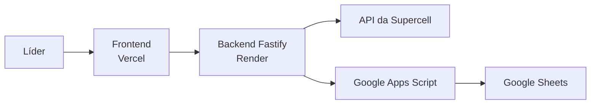

# Arquitetura do Sistema CWL

**Status:** base funcional implementada em 12/06/2026  
**Escopo:** somente CWL  
**Estrutura:** um repositório e um `package.json`

## Estado atual

- Frontend React funcionando localmente.
- Backend Fastify consultando o clã autorizado na API da Supercell.
- Escalação 15x15 ou 30x30 preservada no navegador.
- Sincronização preparada para a CWL ativa.
- Apps Script e modelo anual de planilha versionados no projeto.
- Testes e builds de produção aprovados.

Ainda falta publicar o frontend na Vercel, o backend na Render e implantar o
Apps Script para ativar o histórico permanente.

## Arquitetura definida



## Tecnologias

### Frontend na Vercel

- Vite
- React
- TypeScript
- Tailwind CSS
- Lucide Icons

### Backend na Render

- Node.js
- Fastify
- TypeScript
- Zod
- Cookies assinados
- Rate limiting
- CORS restrito ao domínio da Vercel

### Histórico

- Google Apps Script
- Google Sheets

## Organização

```text
CWL/
  src/
    client/
    server/
    shared/
  apps-script/
  tests/
  package.json
  vite.config.ts
  vercel.json
  render.yaml
```

Não é monorepo. Vercel e Render utilizam o mesmo repositório, mas executam comandos diferentes.

## Responsabilidades

### Vercel

- Hospedar a interface.
- Fazer requisições HTTPS para a Render.
- Não possuir o token da Supercell.

Variável pública:

```text
VITE_API_URL=https://endereco-da-api.onrender.com
```

### Render

- Autenticar o líder.
- Proteger o token da Supercell.
- Consultar grupo, guerras, inscritos, escalados e reservas.
- Calcular pontuações.
- Enviar temporadas ao Apps Script.
- Expor o histórico para o frontend.

A URL da Vercel será cadastrada em `FRONTEND_ORIGIN`. O cookie de produção usará:

```text
HttpOnly
Secure
SameSite=None
```

As faixas exibidas em **Connect > Outbound** serão autorizadas na chave da Supercell.

### Apps Script

- Criar a planilha anual.
- Criar as abas mensais.
- Criar as abas mensais da temporada.
- Salvar ou atualizar linhas.
- Preservar ajustes manuais.
- Listar e carregar temporadas antigas.

Ele não consulta a Supercell e não calcula pontuação.

## Planilhas

Uma planilha por ano:

```text
CWL - Dark Gyn - 2026
CWL - Dark Gyn - 2027
```

Abas de 2026:

```text
CONFIG
CWL_2026_01
...
CWL_2026_06
...
CWL_2026_12
```

Cada linha representa um jogador em uma rodada. A chave de atualização é:

```text
warTag + playerTag
```

Assim, sincronizar novamente atualiza os dados sem duplicá-los.

## Fluxo

1. O líder entra no frontend.
2. O frontend chama a API da Render.
3. A Render consulta a Supercell.
4. O backend identifica inscritos, escalados e reservas.
5. O backend calcula a pontuação.
6. O backend envia a temporada completa ao Apps Script.
7. O Apps Script atualiza a aba da CWL.
8. O frontend apresenta o resultado e o histórico.

## Formatos da CWL

```text
15x15
30x30
```

A temporada é armazenada como:

```text
2026-06
```

## Primeira entrega implementada

- Login.
- Painel operacional.
- Carregamento dos membros oficiais.
- Montagem da escalação 15 ou 30.
- Consulta e sincronização da CWL.
- Ranking atual.
- Apps Script versionado.
- Gerador da planilha anual no Apps Script.
- Rotas de histórico, ativadas após a implantação do Apps Script.

## Evoluções posteriores

- Sincronização automática.
- Relatório PDF na nova interface.
- Editor de ajustes manuais.
- Contas individuais.
- Análise de força ofensiva.
